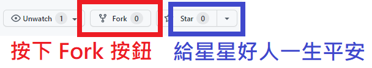

# 💰 簽到機器人 on GitHub Action 💰

## 蝦皮簽到機器人 on GitHub Action!

💰💰 自動化每日簽到領蝦幣 💰💰

- 使用 GitHub Actions 完全免費，且不需要準備自己的機器
- [機器人原始碼](https://github.com/wdzeng/shopee-coins-bot)

### 使用步驟

0. 準備一個 GitHub 帳號。

1. 請將這份專案 fork 到你的帳號下。拜託給星星。

    > 
    >
    > 請選擇右上角的 Fork 按鈕

    > 
    >
    > 按 Create fork

2. 進入你的專案的設定頁面，然後選擇左邊 Secrets 下的 Actions 選項，然後按 New repository secret 按鈕。

    > 

3. 請在 Name 欄位中填入 `SHOPEE_USERNAME`、在 Value 欄位中填入你的蝦皮帳號（可以是 ID、電子信箱或手機號碼）並儲存。

    > 

4. 重複步驟 2. 和 3.，在 Name 欄位中填入 `SHOPEE_PASSWORD`、在 Value 欄位中填入你的蝦皮密碼並儲存。

5. 到[這個網站](https://freeaeskey.xyz/)生成一份金鑰，這份金鑰是用來加密你的 cookie 用的。這份金鑰不能外流，不然以後會被盜帳。

    > 

6. 重複步驟 2. 和 3.，在 Name 欄位中填入 `AES_KEY`、在 Value 欄位中填入你在步驟 5. 複製的金鑰並儲存。

7. 至專案設定的 Actions/General 頁面，滑到最下方選擇 "Read and write permissions"。

   > 

8. 請到 Actions 頁面，啟用 workflow 功能。

    > 

9.  接著進行第一次手動機器人簽到。

    > 

10. 重新整理網頁，你會看到機器人已經在運行。沒意外的話你很快會收到簡訊驗證，希望啦。

   > 

11. 簡訊驗證後，機器人應該會很快成功簽到，如下圖。

    > 

至此，我們已經完成第一次手動機器人簽到。爾後每天早上八點七分，機器人會自動進行簽到。

## Pinkoi 簽到機器人 on GitHub Action!

製作中 🏄‍♂️🏄‍♂️
