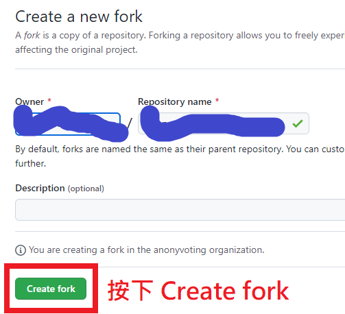

# 蝦皮簽到機器人使用說明

這篇文章說明的是如何使用 GitHub actions 架設屬於自己的蝦皮簽到機器人。

如果你要找的是蝦皮機器人的原始碼或 Docker 操作方式，請右轉[蝦皮簽到機器人原始專案](https://github.com/wdzeng/shopee-coins-bot)。

## 準備

你需要一個 GitHub 帳號，僅此而已喔！

## 設定步驟

### Fork 專案

請將這份專案 fork 到你的帳號下。拜託給星星。

> 
>
> 請選擇右上角的 Fork 按鈕

- 不要 fork shopee-coins-bot，那是原始碼專案，要 fork 你現在在看的這個才對。
- 不要 fork shopee-coins-bot，那是原始碼專案，要 fork 你現在在看的這個才對。
- 不要 fork shopee-coins-bot，那是原始碼專案，要 fork 你現在在看的這個才對。

因為很重要所以要說三遍。

> 
>
> 按 Create fork

### 設定帳號、密碼與加密金鑰

這個機器人將來會需要你的 cookie 來做自動登入，cookie 將會儲存在你的專案上。但是，GitHub 專案上的東西都是公開的，因此我們需要對 cookie 進行加密。

1. 到[這個網站](https://freeaeskey.xyz/)生成一份金鑰，這份金鑰是用來加密你的 cookie 用的。金鑰不要外流，會被盜帳。

    > 

    事實上金鑰就只是 64 個隨機 0-9 和 a-f 的英數字組成而已，你要自己生也行。

2. 進入你的專案的設定頁面，然後選擇左邊 Secrets 下的 Actions 選項，然後按 New repository secret 按鈕。

    > 

3. 填寫需要的資料如下。因為有三份資料，所以這個步驟要執行三次。

    | Name 欄位 | Value 欄位 |
    | ------ | ----- |
    | `SHOPEE_USERNAME` | 蝦皮帳號，可以是電子信箱、手機號碼或 ID。 |
    | `SHOPEE_PASSWORD` | 蝦皮密碼。 |
    | `AES_KEY` | 步驟 1. 產生的金鑰。 |
    
    > 

### 設定機器人的權限

至專案設定的 Actions/General 頁面，滑到最下方選擇 "Read and write permissions"。

   > 

### 啟動機器人

1. 請到 Actions 頁面，啟用 workflow 功能。

    > 

2. 接著進行第一次手動機器人簽到。

    > 

3. 等待大約 10 秒（或重新整理網頁），你會看到機器人已經開始運行。沒意外的話你很快會收到簡訊驗證，希望啦。

    > 

4. 簡訊驗證後，機器人應該會很快成功簽到，如下圖。

    > 

   如果失敗，會呈現下圖。請參考[疑難排解](#疑難排解)。如果沒有頭緒，請參考[錯誤回報](#錯誤回報)。

   > 

至此，我們已經完成第一次手動機器人簽到。

## 自動簽到

第一次手動簽到成功後，**每天早上 08:10 機器人會自動進行簽到**。不用再做其他設定了！

要查看每日簽到的結果，可以至你的專案 Actions 頁面檢查。

## 疑難排解

機器人失敗的最有可能的原因是因為設定了錯誤的帳號與密碼。請參考[設定帳號、密碼與加密金鑰](#設定帳號密碼與加密金鑰)章節，確定 `SHOPEE_USERNAME`、`SHOPEE_PASSWORD`、`AES_KEY` 沒有設錯或打錯字。

另外可參考 workflow 之錯誤訊息。下圖紅色圈起來的地方表示錯誤代碼。

> 

參考錯誤代碼一覽表：

| 錯誤代碼 | 說明 |
| ------- | ---- |
| 3        | 因為短時間內嘗試登入次數過多，觸發了蝦皮的拼圖遊戲。機器人沒辦法解決這個問題，只能一段時間後再試試看了。 |
| 4       | 操作逾時，可能是久沒有執行簡訊驗證。如果你根本沒收到簡訊，可能是蝦皮那邊寄簡訊出問題，也有可能是 bug；如果已經點了簡訊驗證，這大概是機器人的 bug。煩請您回報開發者。 |
| 69      | 因為短時間內嘗試登入次數過多被蝦皮 ban 了。只能一段時間後再試試看。 |
| 87      | 帳號或密碼錯誤。 |

## 錯誤回報

如果你沒有任何頭緒，或覺得問題可能出在機器人本身，可以發個 [issue](https://github.com/wdzeng/bot-automation/issues) 給作者。

回報時，以下幾點值得提及：

- 你的密碼少於 8 個字或超過 16 個字（可參考[此回報](https://github.com/wdzeng/shopee-coins-bot/issues/4)）
- 你的帳號或密碼含有特殊符號（空格、括號、錢字號、引號等）

作者的其他聯繫方式：

- 電子信箱：me@hyperbola.me
- [Telegram](https://t.me/hyperbola_cc)
